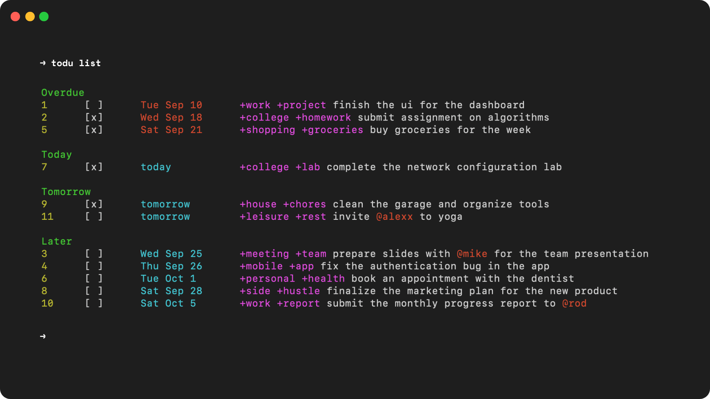

# **Todu CLI**

`todu` is a minimalist, terminal-based to-do list application written in Kotlin. It's designed to help you manage your tasks efficiently from the command line.

<p align="center">
  
</p>

---

## **Features**
- Add new tasks with tags and due dates.
- List tasks by status (overdue, today, tomorrow, later).
- Mark tasks as done or undone.
- Automatically saves tasks to your `~/.todu/tasks.txt` file.
- Lightweight and fast, ideal for productivity enthusiasts who prefer CLI tools.

---

## **Installation**

### **1. Install with Homebrew (macOS)**

The easiest way to install `todu` is through Homebrew, a package manager for macOS and Linux.

1. **Tap the Todu formula:**

   ```bash
   brew tap marceloakalopes/todu
   ```

2. **Install Todu:**

   ```bash
   brew install todu
   ```

3. **Verify Installation:**

   After installation, you can verify it by running:

   ```bash
   todu --help
   ```

### **2. Manual Installation (macOS)**

If you prefer to manually download and install the binary, follow these steps:

1. **Download the Latest Release**

   Go to the [Releases](https://github.com/marceloakalopes/todu/releases) page of this repository and download the `.tar.gz` file for the latest version. Example: `todu-0.1.0.tar.gz`.

2. **Extract the Tarball:**

   After downloading, extract the file:

   ```bash
   tar -xvzf todu-0.1.0.tar.gz
   ```

3. **Move the `todu` Binary to `/usr/local/bin`:**

   To make `todu` accessible globally, move it to a directory in your system's `PATH`:

   ```bash
   sudo mv todu /usr/local/bin/todu
   sudo chmod +x /usr/local/bin/todu
   ```

4. **Verify Installation:**

   You can verify that the installation was successful by running:

   ```bash
   todu --help
   ```

---

## **Usage**

Once installed, you can start using `todu` to manage your tasks from the terminal.

### **Commands**

- **List all tasks:**
  ```bash
  todu list
  ```

  Options:
    - `todu list -o` — List overdue tasks.
    - `todu list -t` — List tasks due today.
    - `todu list -tm` — List tasks due tomorrow.
    - `todu list -l` — List tasks due later.

- **Add a new task:**
  ```bash
  todu new
  ```

- **Delete a task by ID:**
  ```bash
  todu del <task-id>
  ```

- **Mark a task as done:**
  ```bash
  todu check <task-id>
  ```

- **Unmark a task as done:**
  ```bash
  todu uncheck <task-id>
  ```

- **Display Help:**
  ```bash
  todu --help
  ```

---

## **Updating Todu**

To check for new versions and update the app:

```bash
todu --update
```

This will check for the latest version on GitHub. If a new version is available, it will prompt you to update.

---

## **Uninstalling Todu**

If you want to uninstall `todu`, you can do so easily:

```bash
todu --uninstall
```

This will remove the `todu` binary and all associated data from your system.

---

## **Contributing**

Contributions are welcome! Feel free to open issues or submit pull requests to help improve `todu`.

1. Fork this repository.
2. Create your feature branch: `git checkout -b feature/my-feature`
3. Commit your changes: `git commit -am 'Add new feature'`
4. Push to the branch: `git push origin feature/my-feature`
5. Open a Pull Request.

---

## **License**

This project is licensed under the MIT License. See the [LICENSE](LICENSE) file for details.

---
